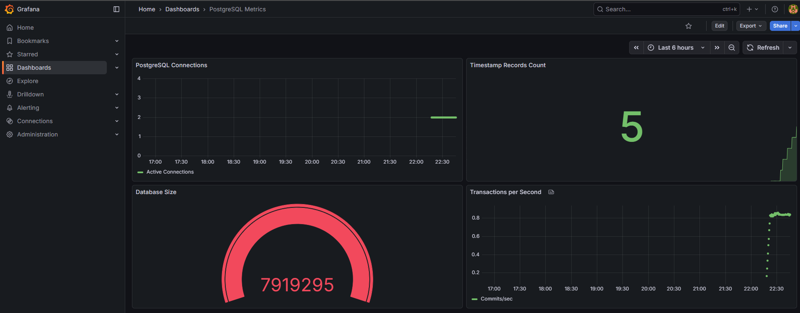
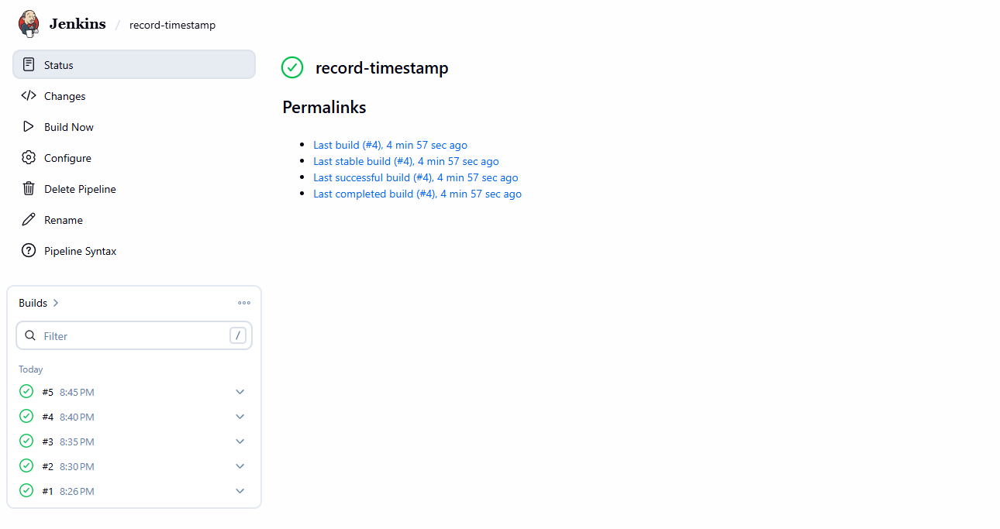

# DevOps Exercise

A complete local Kubernetes environment running Jenkins CI/CD, PostgreSQL database, and Grafana monitoring.

## Quick Start

1. Install tools: Docker, kubectl, Helm, K3d, Terraform
2. Clone this repo
3. Run `./deploy.sh install`
4. Add to `/etc/hosts`: `<EC2-IP> jenkins.local grafana.local`
5. Access:
   - Jenkins: http://jenkins.local (admin/admin123)
   - Grafana: http://grafana.local (admin/admin123)

## Architecture

- K3d cluster (1 server + 2 agents)
- Jenkins with Kubernetes dynamic workers
- PostgreSQL with persistent storage
- Prometheus + Grafana monitoring
- Traefik ingress (no port-forwarding)

## 📊 Screenshots

### Grafana Dashboard - Live PostgreSQL Metrics

*Real-time monitoring showing database connections, timestamp records, database size, and transactions per second*

### Jenkins Pipeline Execution

*Automated job running every 5 minutes with dynamic Kubernetes worker pods*

See [docs/IMPLEMENTATION.md](docs/IMPLEMENTATION.md) for detailed guide.